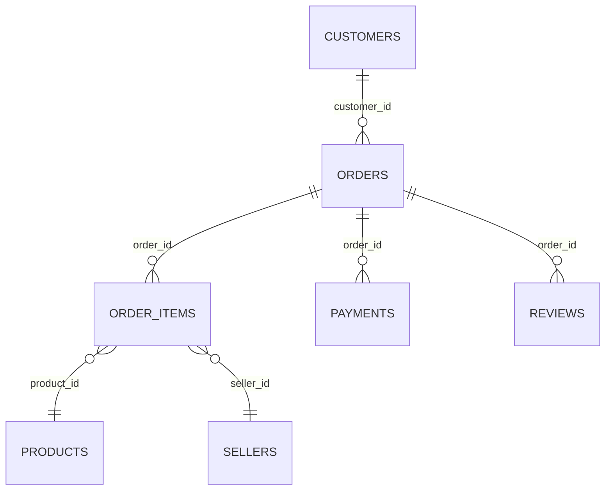

# Conversa — Projeto de Data Science com Olist

> Exportação da conversa visível até 31/07/2026.  
> Não inclui instruções internas, dados de perfil ou mensagens de sistema.

---

## Usuário

> you are going to be my data science professor, we are going to use python and duckdb for all projects.
>
> Let's start using random forest, give
> teach me how to build, train, evaluate and save a model. suggest me a open database that I can use, lets start cleaning it, exploring it, analyzing an everything that have to be done before modeling. lets start converting the csvs to parquet, thats if the data is structured as csv and so on. everything thats necessary in a real data science project
>
> I want to do tests such as DeLong, Bootstrap for confidence intervals, precision@k, calibração com optuna, cobertura do precision@k, brierScore, shap, drift, pai, walkforward, ablation study, and so on...

## Assistente

Vamos usar a base pública Olist já disponível no projeto. O objetivo será prever, de forma honesta e sem vazamento, se um pedido receberá uma avaliação baixa; hoje começamos pela etapa obrigatória de engenharia de dados: inventário, validação de esquema e conversão dos CSVs para Parquet.

O inventário confirmou 9 CSVs estruturados, e DuckDB/PyArrow estão disponíveis. Vou converter os dados brutos sem alterar valores nem “limpar” silenciosamente, registrar o resultado e depois medir qualidade, chaves e relações antes de escolher qualquer feature.

A primeira execução falhou por um erro de aspas no script de perfil, antes de qualquer arquivo ser convertido. Vou corrigir o arquivo, revisar a sintaxe e rodar novamente; a regra aqui é não considerar uma etapa concluída sem validação.

A validação seguinte encontrou um problema real na própria consulta: a contagem de pedidos com múltiplas reviews retornava várias linhas, e DuckDB bloqueou o resultado ambíguo. Vou agregar essa contagem corretamente, sem aceitar o comportamento aleatório sugerido pelo banco.

Ótimo ponto de partida: a base Olist já está convertida de CSV para Parquet e o relatório inicial foi gerado. Usaremos **Random Forest** para prever se um pedido terá avaliação baixa (`review_score` 1 ou 2), mas só depois de construir uma base sem vazamento temporal.

O que foi feito:

- Convertidos os 9 CSVs originais para Parquet com DuckDB, preservando a camada raw sem alterar valores.
- Compressão relevante: por exemplo, geolocalização caiu de **61,27 MB para 16,47 MB**.
- Validada a granularidade:
  - `orders`: 99.441 pedidos, `order_id` único.
  - `reviews`: 99.224 linhas para 98.673 pedidos.
  - Há **547 pedidos com mais de uma review**, então não podemos fazer join direto.
  - `order_items` está no nível de item, também exigindo agregação por pedido.
- Identificado o risco principal: score, texto e timestamps de review não podem entrar como features. Eles ocorrem depois da experiência de compra e causariam leakage.

Arquivos gerados:

- `outputs/olist_parquet/` — camada Parquet raw.
- `outputs/02_data_quality_report.md` — perfil de todas as tabelas, nulos e riscos documentados.
- `outputs/01_inventory.py` e `outputs/02_convert_and_profile.py` — scripts reproduzíveis.

A sequência real do projeto será:

1. Definir momento da previsão e alvo.
2. Limpar, tipar e agregar no nível `order_id`.
3. EDA e análise de qualidade.
4. Split temporal e walk-forward validation.
5. Baseline e Random Forest.
6. Métricas: precision@k, cobertura, Brier, ROC/PR-AUC.
7. Bootstrap CI, DeLong, calibração com Optuna.
8. SHAP, ablation, drift/PSI (PAI) e persistência do modelo.

Um conceito para fixar: **granularidade** é “uma linha representa o quê?”. Em `orders`, uma linha = um pedido. Em `order_items`, uma linha = um item dentro de um pedido. Misturar esses dois níveis sem agregação duplica pedidos e distorce métricas e treinamento.

**Exercício curto:** por que `review_score` como feature para prever `review_score <= 2` seria vazamento, mesmo que melhorasse muito a métrica?

---

## Usuário

> tá, mas faça tudo bem passo a passo porque você deve me ensinar a fazer bem devagar e apresentando toda teoria pratica e estatística, quero começar primento entendendo a base de dados e tudo mais. quero que você me de exercícios e seja bem didático. quero fazer também e não só dar ctrl c ctrl v no seu codigo, por isso não adianta me passar um arquivo de 2000 linhas de uma vez, vamos por etapas curtas com objetivos, teoria, explicações e afins.

## Assistente

Perfeito. Vamos fazer como um projeto real e como uma aula: etapas curtas, teoria antes da prática, código mínimo, exercício, revisão e só então avançamos. Nada de despejar notebook enorme ou treinar modelo antes de entender os dados.

A base Olist é ótima para isso porque simula um e-commerce real. Ela tem pedidos, clientes, produtos, vendedores, pagamentos e avaliações.

## Etapa 1 — entender as entidades e o “grão” dos dados

Antes de limpar ou converter, precisamos responder:

> **Cada linha de cada tabela representa o quê?**

Isso se chama **granularidade** ou *grain*. É uma das coisas que mais causa erros em projetos de dados.

Exemplos na Olist:

| Tabela | Uma linha representa |
|---|---|
| `olist_orders_dataset` | um pedido |
| `olist_customers_dataset` | um registro de cliente ligado a um pedido |
| `olist_order_items_dataset` | um item dentro de um pedido |
| `olist_order_payments_dataset` | uma parcela ou meio de pagamento de um pedido |
| `olist_order_reviews_dataset` | uma avaliação de pedido |
| `olist_products_dataset` | um produto |
| `olist_sellers_dataset` | um vendedor |

### Por que isso importa?

Imagine um pedido com 3 itens e 2 pagamentos.

Se fizermos um `JOIN` direto entre itens e pagamentos, esse pedido pode virar:

\[
3 \text{ itens} \times 2 \text{ pagamentos} = 6 \text{ linhas}
\]

O valor, a contagem e depois as métricas do modelo ficariam errados. Esse problema é chamado de **duplicação por join** ou, informalmente, explosão de linhas.

Por isso, se nosso futuro modelo tiver uma linha por pedido, primeiro vamos resumir itens e pagamentos para o nível de pedido:

- itens: quantidade de itens, preço total, frete total, número de vendedores;
- pagamentos: valor total, número de parcelas, tipo de pagamento;
- reviews: será o nosso possível alvo, não uma feature.

## Conceitos desta etapa

- **Entidade**: algo sobre o qual guardamos dados. Ex.: pedido, produto, cliente.
- **Chave primária**: identificador único da linha. Ex.: `order_id` deveria ser único em `orders`.
- **Chave estrangeira**: campo que conecta uma tabela a outra. Ex.: `customer_id` em `orders`.
- **Grão**: o que uma linha representa.
- **Join**: operação que conecta tabelas por uma chave comum.

## Exercício 1

Responda com suas palavras, sem pesquisar:

1. Qual é o grão da tabela `olist_order_items_dataset`?
2. Por que `order_id` pode aparecer repetido nessa tabela, mas não deveria repetir em `olist_orders_dataset`?
3. Se um pedido tem 2 itens e 3 registros de pagamento, quantas linhas podem surgir em um join direto entre essas duas tabelas?
4. Para prever uma avaliação ruim de um pedido, `review_score` deve ser feature ou alvo? Explique o motivo.

Na próxima etapa, depois das suas respostas, vamos construir juntos um **mapa relacional da base** e verificar, com poucas consultas DuckDB, se as chaves realmente se comportam como esperamos.

---

## Usuário

> 1-cada linha representa um item de um pedido
> 2-porque cada pedido pode ter varios itens, e para cada um desses itens aparece o id do seu pedido, ja a entidade pedidos deve não deve se repetir porque cada linha é um pedido diferente, não deve haver duplicação.
> 3-2x3=6 linhas
> 4-sim, porque a ideia é prever o score da avaliação né?

## Assistente

Você acertou muito bem 1, 2 e 3. A lógica de granularidade ficou clara.

No item 4, só precisamos ajustar uma palavra importante: `review_score` deve ser o **alvo**, não uma feature.

O modelo recebe as **features** para tentar prever o **alvo**.

- Features: informação disponível no momento da previsão, como valor do pedido, quantidade de itens, estado do cliente.
- Alvo: o resultado que queremos prever. Aqui, uma avaliação baixa.

Se colocarmos `review_score` entre as features, estaremos entregando a resposta ao modelo. Isso é **data leakage**. Ele teria métrica excelente no teste, mas seria inútil em produção porque o score ainda não existe quando queremos prever.

No nosso caso, vamos transformar o score em classificação binária:

\[
y =
\begin{cases}
1, & \text{se review\_score} \leq 2 \quad \text{(avaliação baixa)} \\
0, & \text{se review\_score} > 2 \quad \text{(não baixa)}
\end{cases}
\]

Ainda não vamos criar essa coluna. Primeiro, precisamos confirmar as relações entre tabelas.

## Etapa 2 — testar as chaves com DuckDB

Uma relação desenhada no esquema não é prova de que os dados reais respeitam a regra. Vamos testar.

A relação principal é esta:



`||--o{` significa “uma linha de um lado pode se relacionar com várias linhas do outro”.

Agora execute você mesmo este código curto. Ele confere se `order_id` é realmente único na tabela de pedidos.

```python
import duckdb

con = duckdb.connect()

con.sql("""
    SELECT
        COUNT(*) AS total_linhas,
        COUNT(DISTINCT order_id) AS pedidos_unicos,
        COUNT(*) - COUNT(DISTINCT order_id) AS duplicados
    FROM read_parquet(
        'outputs/olist_parquet/olist_orders_dataset.parquet'
    )
""").show()
```

### Como interpretar

- `COUNT(*)`: total de linhas.
- `COUNT(DISTINCT order_id)`: quantos IDs diferentes existem.
- `duplicados`: diferença entre ambos.

Para `orders`, esperamos `duplicados = 0`. Encontramos:

- `total_linhas`: 99.441  
- `pedidos_unicos`: 99.441  
- `duplicados`: 0  

Agora faça a mesma checagem para itens, mudando apenas o caminho do Parquet:

```python
con.sql("""
    SELECT
        COUNT(*) AS total_linhas,
        COUNT(DISTINCT order_id) AS pedidos_com_itens,
        COUNT(*) - COUNT(DISTINCT order_id) AS repeticoes_de_order_id
    FROM read_parquet(
        'outputs/olist_parquet/olist_order_items_dataset.parquet'
    )
""").show()
```

Aqui esperamos repetição, pois cada pedido pode ter vários itens. O resultado observado é:

- 112.650 linhas de itens;
- 98.666 pedidos com pelo menos um item;
- portanto, 13.984 linhas além da primeira ocorrência de cada pedido.

**Exercício 2**

1. Por que `COUNT(*) - COUNT(DISTINCT order_id)` não significa necessariamente “dados duplicados” em `order_items`?
2. Dos 99.441 pedidos, só 98.666 têm itens. Cite duas hipóteses para os pedidos sem item.
3. Em qual etapa devemos investigar se esses pedidos sem itens são erro, cancelamento ou outro status: antes ou depois de treinar o modelo? Explique.

---

## Usuário

> exporte tudo desse char em um .md
